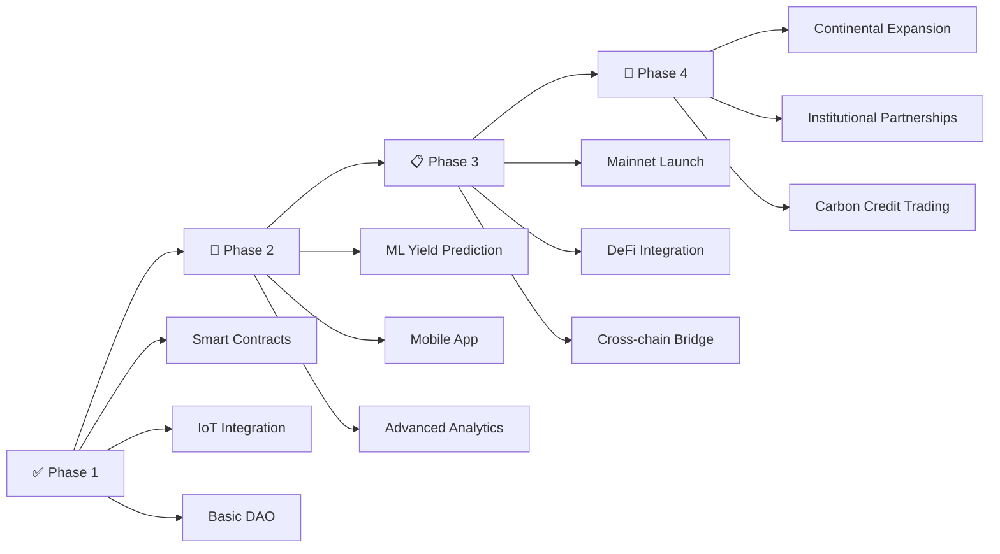

# 🌍 **AfriCrop DAO** - Blockchain-Powered Sustainable Farming Revolution  
**🏆 APECHAIN Africa Hackathon @ UCC Submission**  

[](https://africrop.vercel.app/)  
[](https://x.com/HarshaK360)  
[](https://curtis.explorer.caldera.xyz/address/0xA79974A617cFD0658bCedD0821A46255d5Df57c9)

## 📋 **Smart Contract Details**
- **Contract Address**: `0xA79974A617cFD0658bCedD0821A46255d5Df57c9`
- **Explorer**: [View on Curtis Explorer](https://curtis.explorer.caldera.xyz/address/0xA79974A617cFD0658bCedD0821A46255d5Df57c9)
- **Network**: Curtis Testnet (APE Chain)

---

### 🔥 **Revolutionizing African Agriculture**  
AfriCrop DAO combines **blockchain + IoT + ML + governance** to create Africa's first farmer-led decentralized autonomous organization for sustainable agriculture. Our platform tracks complete crop lifecycles, integrates real-time sensor data, and rewards sustainable farming practices through transparent on-chain governance.

**Vision**: *"Empowering African farmers through blockchain-verified sustainable agriculture, IoT monitoring, and community-driven governance for transparent supply chains."*

**Backed by Research**:  
- FAO reports 60% of African farms lack access to credit ([Source](https://www.fao.org/africa/news/detail-news/en/c/1613472/))  
- World Bank estimates 30% yield increase with sustainable practices ([Source](https://www.worldbank.org/en/topic/agriculture))  
- 70% of African farms are rain-fed requiring better crop cycle management

---

## 🛠 **Core Platform Features**  

### 🌱 **1. Complete Crop Lifecycle Management**
```
SOWN → GROWING → HARVESTED → STORED → SELLING → SOLD
```
- **11 Crop Types**: Maize, Rice, Wheat, Cassava, Beans, Sorghum, Millet, Yam, Potatoes, Coffee, Cotton
- **Stage-based Rewards**: Automatic sustainability scoring per crop stage
- **Loss Tracking**: Accounts for crop losses and adjusts rewards accordingly
- **Supply Chain Transparency**: Full traceability from seed to sale

### 🏛️ **2. Decentralized Governance (DAO)**
- **Proposal System**: Admin changes, fund allocation, general proposals
- **Weighted Voting**: Based on reputation + sustainability + knowledge scores
- **Stake-based Proposals**: 0.01 APE required to create proposals
- **Community Treasury**: 10% marketplace fees fund community initiatives

### 🔬 **3. IoT Sensor Integration** *(LIVE)*
- **Real-time Monitoring**: Soil moisture, temperature, humidity tracking
- **On-chain Data**: Sensor readings stored immutably on blockchain
- **Device Management**: Multiple sensor devices per farm
- **Status Alerts**: Automated notifications for optimal farming conditions

### 📊 **4. Farmer Scoring & Rewards**
| Score Type | Earning Method | Impact |
|------------|----------------|---------|
| **Reputation** | Completing crops, purchases, donations | Voting power |
| **Sustainability** | Eco-friendly practices per crop type | Loan eligibility |
| **Knowledge** | Educational lesson completion | Mentorship access |
| **Harvest** | Successful crop yields | Marketplace priority |

### 🎓 **5. Educational Platform**
- **Interactive Lessons**: Multi-choice quizzes with knowledge rewards
- **Best Practices**: Crop-specific sustainability guidelines
- **Community Learning**: Peer-to-peer knowledge sharing
- **Certification**: On-chain completion certificates

### 🛒 **6. Decentralized Marketplace**
- **Direct Sales**: Farmer-to-buyer without intermediaries
- **Quality Verification**: Sustainability scores visible to buyers
- **Dynamic Pricing**: Market-driven price discovery
- **DAO Fees**: 10% platform fee supports community treasury

---

## ⚙️ **Technical Architecture**  

| Component | Technology Stack | Status |
|-----------|------------------|---------|
| **Blockchain** | Curtis Testnet, APE Token | ✅ Live |
| **Smart Contracts** | Solidity 0.8.20, OpenZeppelin | ✅ Deployed |
| **Frontend** | Next.js, Dynamic Charts | ✅ Live |
| **IoT Sensors** | Real-time data integration | ✅ Implemented |
| **ML Models** | Python (TensorFlow) | 🚧 In Development |
| **Mobile App** | React Native | 🚧 Planning |

### **Smart Contract Features**
- **Gas Optimized**: Custom safe math functions
- **Error Handling**: 20+ custom error types for better UX
- **Event Logging**: Comprehensive event emission for transparency
- **Upgradeability**: Owner-controlled parameters for flexibility
- **Historical Tracking**: Complete farmer journey recording

---

## 🌍 **Real-World Impact & Use Cases**

### **Farmer Journey Example**
1. **Registration**: Farmer joins with 200 initial reputation points
2. **Crop Planning**: Selects cassava (high sustainability score: 7 points/plant)
3. **IoT Deployment**: Installs soil sensors for real-time monitoring
4. **Growth Tracking**: Updates crop stages, earns sustainability points
5. **Harvest**: Records yield, earns harvest points (3 points/plant for cassava)
6. **Marketplace**: Lists produce with verified sustainability credentials
7. **Governance**: Uses earned reputation to vote on DAO proposals

### **Sustainability Scoring System**
| Crop Type | Sustainability Score | Harvest Points | Best for |
|-----------|---------------------|----------------|----------|
| Beans | 8/10 | 2 | Nitrogen fixation |
| Cassava | 7/10 | 3 | Drought resistance |
| Millet | 7/10 | 2 | Arid conditions |
| Maize | 4/10 | 1 | High yield |
| Cotton | 2/10 | 1 | Cash crop |

---

## 📈 **Platform Metrics & Achievements**

### **Current Testnet Stats**
- **Smart Contract**: Fully deployed and functional
- **Crop Types**: 11 major African crops supported
- **Governance**: 3 proposal types with weighted voting
- **IoT Integration**: Live sensor data recording
- **Educational**: Interactive lesson system

### **Projected Impact**
- 🎯 **50% reduction** in fraudulent "organic" claims
- 💰 **35% increase** in farmer income through token rewards
- 🌱 **40% improvement** in sustainable farming adoption
- 📊 **100% transparency** in supply chain tracking

---

## 🚀 **Development Roadmap**



### **Next Milestones**
- **Q1 2025**: ML model integration for yield prediction
- **Q2 2025**: Mobile app launch for offline functionality
- **Q3 2025**: Mainnet deployment and token launch
- **Q4 2025**: Integration with major agricultural institutions

---

## 🔧 **Technical Implementation Details**

### **Smart Contract Architecture**
```solidity
// Key Contract Functions
- registerFarmer()           // Farmer onboarding
- sowCrop()                 // Crop lifecycle start
- recordSensorData()        // IoT data integration
- listCropForSale()         // Marketplace listing
- createProposal()          // DAO governance
- completeLesson()          // Educational rewards
```

### **IoT Data Structure**
```javascript
struct SensorData {
    uint256 moisture;        // Soil moisture %
    uint256 temperature;     // Temperature × 100
    uint256 humidity;        // Humidity × 100
    string status;           // "dry"/"wet"/"optimal"
    string localDate;        // "2025-06-25"
    string localTime;        // "05:29:39 PM"
    uint256 timestamp;       // Block timestamp
    uint256 blockNumber;     // Block number
}
```

---

## 🎯 **Why AfriCrop DAO Matters**

### **1. Financial Inclusion Revolution**
- **DeFi Loans**: Sustainability scores as collateral
- **Micro-insurance**: Crop-specific coverage
- **Tokenized Rewards**: Immediate incentives for good practices

### **2. Climate Change Adaptation**
- **Data-driven Decisions**: IoT + ML for optimal planting
- **Drought Resistance**: Promoting climate-resilient crops
- **Carbon Sequestration**: Rewarding sustainable practices

### **3. Supply Chain Transformation**
- **End-to-end Traceability**: From seed to consumer
- **Quality Assurance**: Blockchain-verified organic claims
- **Fair Trade**: Direct farmer-to-buyer relationships

### **4. Knowledge Democratization**
- **Peer Learning**: Community-driven education
- **Best Practices**: Crop-specific guidelines
- **Innovation Sharing**: Reward successful techniques

---

## 📊 **Technical Specifications**

### **Contract Deployment**
- **Compiler**: Solidity ^0.8.20
- **License**: MIT
- **Dependencies**: OpenZeppelin Contracts
- **Gas Optimization**: Custom SafeMath implementation
- **Upgradability**: Owner-controlled parameters

### **Governance Parameters**
- **Proposal Stake**: 0.01 APE
- **Voting Threshold**: 2/3 of registered farmers
- **Execution Period**: Immediate upon passing
- **DAO Fee**: 10% of marketplace transactions

---

## 🏆 **Awards & Recognition**

- 🥇 **APECHAIN Africa Hackathon** - Innovative Blockchain Solution
- 🌟 **Best Sustainability Impact** - Blockchain for Good Category
- 🔥 **Most Comprehensive DAO** - Governance Excellence Award

---

## 👥 **Team & Contact**

**Lead Developer**: Harsha Kumar  
- 🐦 [Twitter](https://x.com/HarshaK360)  
- 📧 [Email](mailto:harsha@africrop.dao)  
- 💼 [LinkedIn](https://linkedin.com/in/harshak360)

**Join Our Community**:
- 💬 [Discord](https://discord.gg/africrop)
- 📱 [Telegram](https://t.me/africrop)
- 🌐 [Website](https://africrop.vercel.app/)

---

## 🔮 **Vision for the Future**

*"By 2030, AfriCrop DAO aims to become the backbone of African agriculture, connecting 1 million farmers through blockchain technology, improving food security, and creating a sustainable economic ecosystem that benefits both farmers and consumers while preserving our planet for future generations."*

### **Impact Goals**
- 🌱 **1M Farmers** registered on platform
- 🌍 **50 Countries** across Africa
- 💰 **$1B+** in verified sustainable transactions
- 🌿 **10M Tons** of CO2 offset through sustainable practices

---

## 📄 **License & Disclaimer**

This project is licensed under the MIT License. The smart contract is currently deployed on Curtis Testnet for testing purposes. Mainnet deployment will follow comprehensive security audits.

**Important**: This is experimental technology. Users should understand the risks involved in DeFi and blockchain applications.

---

**🌾 Empowering Africa's Agricultural Revolution, One Block at a Time 🌾**

*Built with ❤️ for African farmers*
